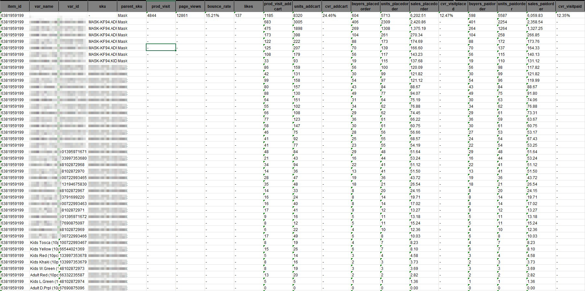
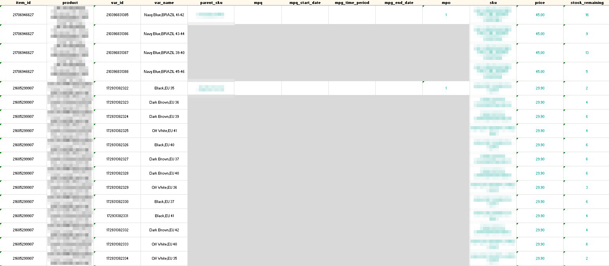
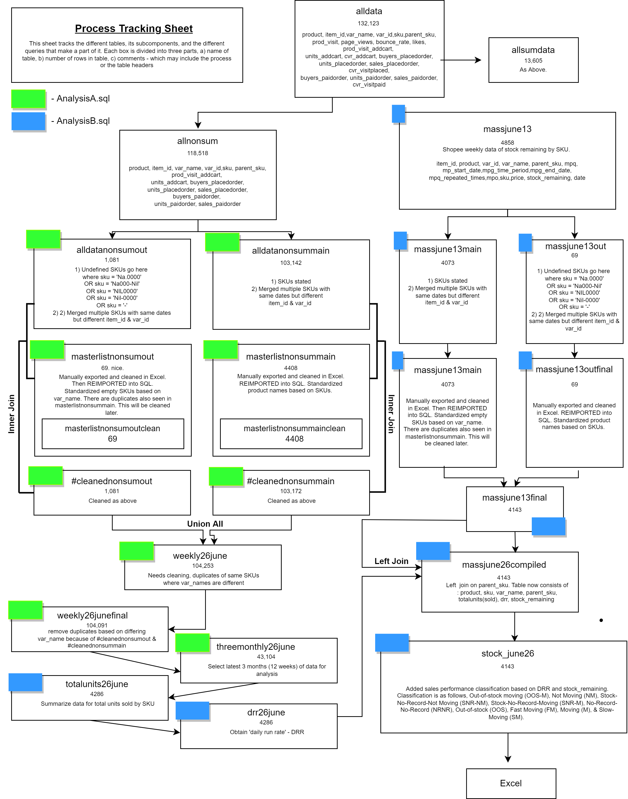
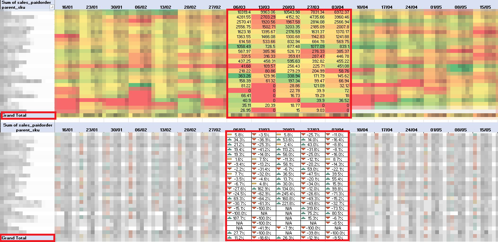
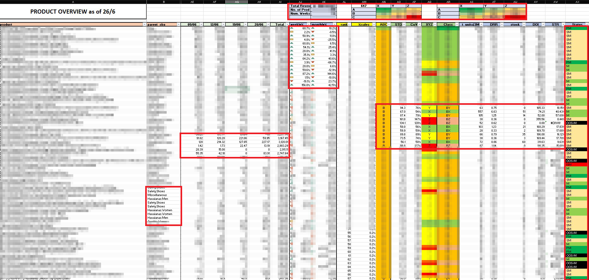
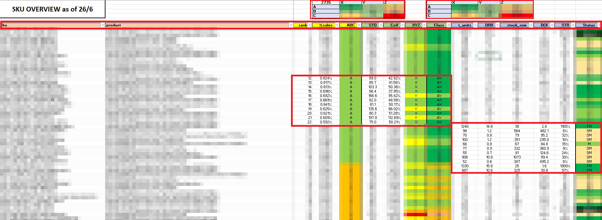

# Sales & Inventory Analyst Project
##  Table of Contents 
* [1. Introduction](#intro)
    * [1.1 Business Needs](#limitations)
    * [1.2 Objectives](#objectives)
* [2. Dataset Used & Limitations](#dataused)
    * [1.1 Weekly Sales Data](#weeklysales)
    * [1.2 Weekly Stock Data](#weeklystock)
* [3. Data Cleaning & Munging](#dataclean)
    * [3.1 Process](#process)
    * [3.2 SQL Query](#sql)
    * [3.3 Process Tracking Flowchart](#flowchart)
* [4. Analysis](#dataclean)
    * [4.1 Metrics Used to Improve Analysis](#metric)
    * [4.2 Analysis A - Sales Trend Across Weeks By Category/Parent_SKU](#analysisa)
    * [4.3 Analysis B - Product Overview](#analysisb)
    * [4.4 Analysis C - SKU Overview](#analysisc)

## 1. Introduction
This is my proof of work as a Sales & Inventory Analyst at a footwear &amp; accessories company. Includes SQL queries and Excel dashboards. 

The company stocks over 4000+ items across 700+ products and 21 product categories. Their products are largely sold on e-commerce platforms such as Shopee, Lazada & Qoo10, bringing in on average 5-digits in weekly sales. 

### 1.1 Business Needs
The client found limitations in analysis arising from the following: 
* Limitations of the Shopee's Business Insights Platform to view data beyond basic trends and performances metrics
* Due to UI limitations, the platform does not make it easy to view items, products & categories at a glance. One has to click multiple times to obtain the desired information
* Stock ordering strategies the company takes is largely based on a top-down approach where more can be done to integrate the value that the data provides

### 1.2 Objectives
I was brought in to provide an analysis on the following: 
* Identify sales trend across different SKUs, products, and categories
* Identify best performing and worst performing items 
* Provide recommendations on which items to push for, and which items to ramp down orders 
* Identify ways to speed up stock-ordering times

## 2. Dataset Used & Limitations

The data provided by the client are 2 .csv files:

### 2.1 Weekly Sales Data
* Sales data that is released weekly on Mondays. Unfortunately, Shopee does not provide sales data by day or time of day. Limiting analysis from  identifying day-of-week and time-of-day trends.
* Sales data provided from Nov 21' - Present. This limits the level of analysis from including time series forecasting methods such as SARIMA. 
* Columns include Product, Item ID, Variation Name, SKU, Parent SKU, Product Visitors, Product Page Views, Product Bounce Rate, Likes, Product Visitors (Add to Cart), Units (Add to Cart), Conversion Rate (Add to Cart), Buyers (Placed Order), Units (Placed Order), Sales (Placed Order), Conversion Rate (Visit to Placed), Buyers (Paid Orders), Units (Paid Orders), Sales (Paid Orders), Conversion (Visit to Paid)

### 2.2 Weekly Remaining Stock Data
* The table consists of stocks remaining for each SKU. The table can be pulled from the Shopee Business Insight platform on-demand. 
* Columns include Product ID, Product Name, Variation ID, Variation Name, Parent SKU, SKU, Price, Stock (remaining)

## 3. Data Cleaning & Munging

### 3.1 Process
* Joining weekly sales data from Nov' 21 to Present
* Cleaning and standardising multiple entries of similar products but with different listings/SKUs entries 

        * Same products that are listed slightly differently, e.g. Brand_Slippers_US11_DarkBlue and Slippers_Brand_US11_blue
        
        * Products where SKU are listed as NIL.000, NA-000, NiL-ooo but use var_name as their anchor key
        
* Creating a master_list of standardised product/SKU names for over 4000+ SKUs as future reference
* Joining weekly sales data with weekly stock remaining tables 

### 3.2 SQL Query
* MSSQL was used to process and clean the data. 
* SQL queries are spread across 3 different files so that it can be easily managed. You may view them here [AnalysisA.sql](sql_query/AnalysisA.sql) | [AnalysisB.sql](sql_query/AnalysisB.sql) | [WeeklyUnionAll.sql](sql_query/WeeklyUnionAll.sql)

### 3.3 Process Tracking
* I have used a flowchart to keep track of the work: 

## 4. Analysis
### 4.1 Metrics Used to Improve Analysis
Based on elements from supply chain management, I have added several metrics to value-add onto the analysis. These metrics provide a comprehensive overview of sales performances across product and SKU levels. 

| Metrics | Desc. |
| --- | --- |
| weekly% | % change in sales between latest and previous week e.g. week 14 vs week 13 |
| 4weekly% | % change in sales between latest 4 weeks and previous 4 weeks. For e.g. difference between sum(W8+W9+W10+W11) and sum(W12+W13+W14+W15). This is different is not a monthly difference. s  |
| %sales | As above.  |
| ABC | The ABC analysis provides a mechanism for identifying items that will have a significant impact on overall inventory cost. 'A' items are very important for an organization. Because of the high value of these 'A' items, frequent value analysis is required. In addition to that, an organization needs to choose an appropriate order pattern (e.g. 'just-in-time') to avoid excess capacity. 'B' items are important, but of course less important than 'A' items and more important than 'C' items. Therefore, 'B' items are intergroup items. 'C' items are marginally important. |
| STD | Standard deviation of all available sales data (32 weeks). Measure of how dispersed the data is in relation to the mean. |
| CoV | Ratio of the standard deviation to the mean and show the extent of variability in relation to the mean of the population. Higher the CoV, the greater the dispersion. |
| XYZ | Way to classify inventory items according to variability of their demand. <li> X - very little variation. X items characterised by steady turnover over time. Future demand can be reliably forecasted. </li><li>Y – Some variation: Although demand for Y items is not steady, variability in demand can be predicted to an extent. This is usually because demand fluctuations are caused by known factors, such as seasonality, product lifecycles, competitor action or economic factors. It's more difficult to forecast demand accurately. </li><li>Z – The most variation: Demand for Z items can fluctuate strongly or occur sporadically. There is no trend or predictable causal factors, making reliable demand forecasting impossible. </li>|
| Class | [ABC-XYZ Classification](https://abcsupplychain.com/wp-content/uploads/2019/06/abc-xyz-analysis-matrix.png) |
| t_units | Total units sold in the last 12 weeks ( 3 months//84 days). Range of 3 months picked to obtain a bigger picture of the immediate trend. |
| DRR | Daily run rate (DRR) = sales you’ve made in last 84 days divided by 84 days (aka avgsalesperday) |
| stock_rem | Stock remaining obtained from mass table |
| DOI | The average time a company keeps its inventory before it is sold. Days of inventory = stock_rem/DRR |
| STR | The expected amount of inventory sold within the month as a percentage of the amount of inventory in stock.  For e.g. Having an STR of 18% means that you will sell off 18% of the current stock within the next 30 days. But do note that this is a rough gauge and should not be seen as a forecast! |
| Status |  <ul><li>FM (Fast moving) - DOI > 0 and < 31</li><li>M (Moving) - DOI > 30 < 91</li><li>SM (Slow Moving) - DOI > 90 </li><li>NM (Not Moving) </li><li>OOS-M (Items sold until it is currently OOS)</li><li>OOS-NR (Items OOS but no record of items sold, zero is still recorded data) </li><li>SNR-NM (Stock No Record - Not Moving) No records available of the item in the mass table </li><li>SNR-M (Stock No Record - Moving) Item is sold based on sales data, but no record of stock availability in the mass table. </li><li>NRNR (No record of sales nor stock availability)</li></ul>  |

### 4.2 Analysis A - Sales Trend Across Weeks By Category/Parent_SKU
This is a table that provides an overview of weekly performances across the entire data range, together with week on week percentage increase/decrease. 

### 4.3 Analysis B - Product Overview
This is a table that provides an overview of weekly performances by product level together with the metrics as shown in the table above. 

### 4.4 Analysis C - SKU Overview
This is a table that provides an overview of weekly performances by SKU level that includes the different sizes of each product. Additionally, metrics as shown in the table above is also used. 

